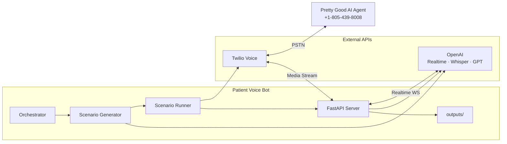
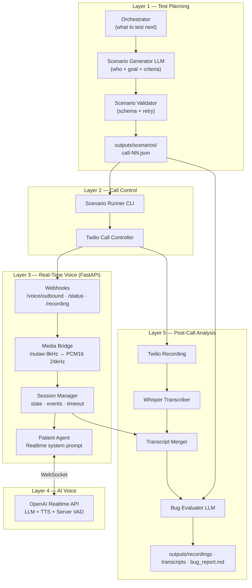
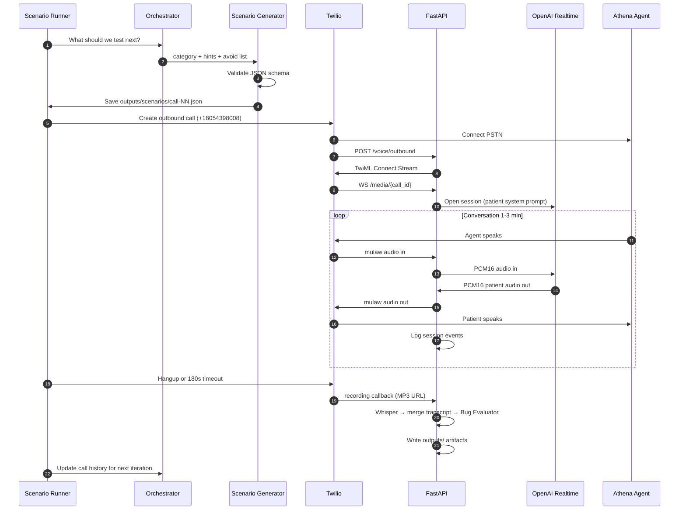
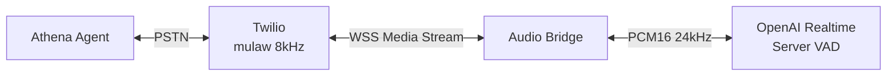
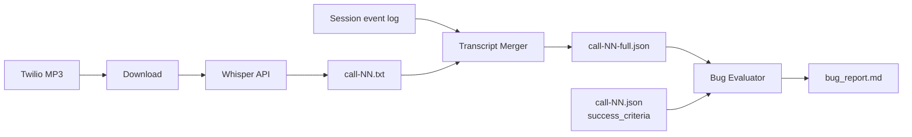

# Architecture

## Overview

This system is an automated **patient simulator** that places outbound phone calls to Pretty Good AI's test line (`+1-805-439-8008`), conducts natural voice conversations, and produces recordings, transcripts, and bug reports.

The architecture has two phases:

1. **Pre-call planning** — An Orchestrator and Scenario Generator (LLM) invent diverse, realistic patient test cases at runtime. No hardcoded dialogue scripts.
2. **Call execution + analysis** — Twilio handles telephony; FastAPI bridges audio to OpenAI Realtime where the Patient Agent speaks; after hangup, Whisper transcribes and an Evaluator LLM checks results against generated success criteria.

Scenarios are **generated, not hardcoded**, but every generated scenario is **saved to disk** before the call so runs are reproducible and bug reports cite a concrete test definition.

---

## System context



---

## Layered architecture



---

## LLM roles (four distinct jobs)

| Agent | Model | When | Input | Output |
|-------|-------|------|-------|--------|
| **Orchestrator** | GPT-4o | Before each call | Call history, categories used, prior bugs | `next_category`, hints, avoid list |
| **Scenario Generator** | GPT-4o | Before each call | Orchestrator hints + constraints | Full scenario JSON |
| **Patient Agent** | Realtime API | During call | Generated scenario → system prompt | Spoken patient audio |
| **Bug Evaluator** | GPT-4o | After call | Scenario JSON + transcript | Structured bug findings |

The Patient Agent never sees `success_criteria` during the call — only persona, goal, and behavior — so it cannot game the test.

---

## Generated scenario schema

Every scenario is saved as `outputs/scenarios/call-{NN}.json` before dialing.

```json
{
  "id": "call-07-gen",
  "category": "edge_case",
  "patient": {
    "name": "Jordan Lee",
    "dob": "09/22/1991",
    "phone": "415-555-0188",
    "insurance": "Kaiser HMO"
  },
  "goal": "Request a lisinopril refill, then interrupt to ask if the office is open Saturdays.",
  "behavior": [
    "Start with the refill request",
    "Mid-call, interrupt with a hours question",
    "Stay polite; keep responses to 1-2 sentences"
  ],
  "success_criteria": [
    "Agent handles interruption without losing refill context",
    "Agent answers Saturday hours accurately",
    "Agent does not schedule on closed days"
  ],
  "tags": ["refill", "interruption", "multi_intent"],
  "generated_at": "2026-07-01T12:00:00Z",
  "orchestrator_hint": "Test multi-intent handling after 6 scheduling calls"
}
```

Optional seed files in `scenarios/seeds/` exist only for local debugging — batch runs use generated scenarios.

---

## Call sequence



---

## Audio pipeline



| Direction | Format | Handler |
|-----------|--------|---------|
| Twilio → Server | mulaw, 8 kHz, base64 JSON | `voice/audio_utils.py` |
| Server → Realtime | PCM16, 24 kHz | resample + append buffer |
| Realtime → Server | PCM16, 24 kHz | response audio deltas |
| Server → Twilio | mulaw, 8 kHz | resample + encode |

---

## Orchestrator logic

The Orchestrator ensures **diversity across 10+ calls** and optional **adaptive retesting**.

**Inputs:**
- `call_history.json` — past call IDs, categories, durations, bug counts
- `bug_report.md` — summaries of issues found
- Target distribution (e.g. 30% edge cases)

**Outputs:**
```json
{
  "next_category": "edge_case",
  "hint": "Patient insists on Sunday morning appointment",
  "avoid": ["simple_scheduling", "basic_refill"],
  "rationale": "6 scheduling calls done; no weekend-hours test yet"
}
```

**Category pool:** `scheduling`, `reschedule`, `cancel`, `refill`, `insurance`, `hours_location`, `edge_case`, `interruption`, `ambiguous_request`

---

## Patient Agent prompt (built from generated scenario)

```
You are {patient.name}, a real patient calling a medical office.

Your goal: {goal}

When asked, your details are:
- Date of birth: {patient.dob}
- Phone: {patient.phone}
- Insurance: {patient.insurance}

How to behave:
{behavior bullets}

Rules:
- Never say you are a bot, tester, or AI
- Sound natural; prefer 1-2 sentences per turn
- Actively work toward your goal
- Answer the agent's questions cooperatively
```

---

## Post-call pipeline



**Bug report entry references:**
- `outputs/transcripts/call-NN.txt` — readable transcript
- `outputs/recordings/call-NN.mp3` — audio evidence
- `outputs/scenarios/call-NN.json` — what was being tested

---

## Repository structure

```
PreetyGoodAIChallenge/
├── ARCHITECTURE.md
├── README.md
├── .env.example
├── requirements.txt
├── main.py                         # uvicorn entry
├── runner.py                       # CLI: batch, single, generate-only
│
├── app/
│   ├── main.py                     # FastAPI routes
│   └── session_registry.py         # active CallSession lookup
│
├── planning/
│   ├── orchestrator.py             # LLM: pick next test focus
│   ├── generator.py                # LLM: create scenario JSON
│   ├── validator.py                # schema check + retry
│   └── history.py                  # call_history.json read/write
│
├── telephony/
│   └── twilio_client.py            # outbound call + hangup
│
├── voice/
│   ├── bridge.py                   # Twilio WS ↔ Realtime WS
│   └── audio_utils.py              # mulaw, resample
│
├── patient/
│   ├── agent.py                    # Realtime session + prompt builder
│   └── models.py                   # Scenario dataclass
│
├── analysis/
│   ├── pipeline.py                 # post-call orchestration
│   ├── transcriber.py              # Whisper wrapper
│   └── evaluator.py                # bug detection LLM
│
├── scenarios/
│   └── seeds/                      # optional debug scenarios only
│
└── outputs/
    ├── scenarios/                  # generated call-NN.json (committed)
    ├── recordings/                 # call-NN.mp3
    ├── transcripts/                # call-NN.txt, call-NN-full.json
    ├── logs/
    ├── call_history.json
    └── bug_report.md
```

---

## Key design choices

**1. Generated scenarios, not hardcoded scripts.** The Athena agent asks questions in unpredictable order. A Scenario Generator LLM produces diverse test intent; the Realtime Patient Agent adapts at call time. This finds more bugs than fixed YAML dialogue.

**2. Save every generated scenario before calling.** Dynamic generation does not mean non-reproducible runs. Saved JSON links each bug to a concrete test definition — required for a credible bug report.

**3. Orchestrator separate from Generator.** One LLM decides *what category to test*; another invents *the specific patient story*. Separation keeps batch runs diverse (no 10 scheduling calls in a row) and allows adaptive retesting after bugs are found.

**4. Twilio + Realtime for voice; GPT-4o for planning and evaluation.** Realtime API is used only where latency matters (live conversation). Cheaper Chat Completions handle scenario generation and bug analysis — keeps total cost under $20.

**5. Post-call Whisper on Twilio recording.** One transcription pass on the full two-sided MP3. No duplicate real-time transcription. Session event logs supplement speaker labeling.

**6. Local file artifacts, no database.** Recordings, transcripts, scenarios, and bug reports map directly to GitHub submission requirements.

---

## Turn-taking policy

- OpenAI Realtime **server VAD** detects when the Athena agent finishes speaking.
- Default: no barge-in (patient waits for agent) except in `interruption` category scenarios.
- Optional 300–500 ms response delay if pacing feels too fast in early iterations.
- Max call duration: **180 seconds**; patient prompt warns to wrap up at 150 s.

---

## Deployment

| Environment | Role |
|-------------|------|
| Local + ngrok | Development; `PUBLIC_BASE_URL` for Twilio webhooks |
| Render / Fly.io | Stable URL for batch runs of 10+ calls |

**Runtime (batch):**
```bash
# Terminal 1
uvicorn app.main:app --host 0.0.0.0 --port 8000

# Terminal 2
ngrok http 8000   # set PUBLIC_BASE_URL in .env

# Terminal 3
python runner.py batch --count 12
```

---

## Failure handling

| Failure | Action |
|---------|--------|
| Invalid generated JSON | Retry generator up to 3×; skip category on persistent failure |
| Twilio call failed | Log to `outputs/logs/`; do not run post-call; retry once |
| WebSocket drop mid-call | Graceful hangup; save partial session log |
| Recording unavailable | Fall back to session event log; flag in metadata |
| Evaluator finds no issues | Still write entry: "No issues detected against criteria" |

---

## Cost controls

| Item | Estimate (12 calls × 2.5 min) |
|------|-------------------------------|
| Twilio outbound | ~$0.50–1.50 |
| OpenAI Realtime | ~$5–10 |
| Whisper (post-call) | ~$1–2 |
| GPT-4o (orchestrator + generator + evaluator × 12) | ~$1–3 |
| **Total** | **~$8–17** |

- Cap calls at 180 s.
- One Realtime session per call; close WebSocket on hangup.
- No real-time + post-call double transcription.

---

## CLI modes

```bash
python runner.py batch --count 12          # generate + call + analyze (submission run)
python runner.py generate --count 5        # preview scenarios without calling
python runner.py call --scenario outputs/scenarios/call-03.json
python runner.py call --seed scenarios/seeds/weekend_appointment.yaml  # debug only
```
